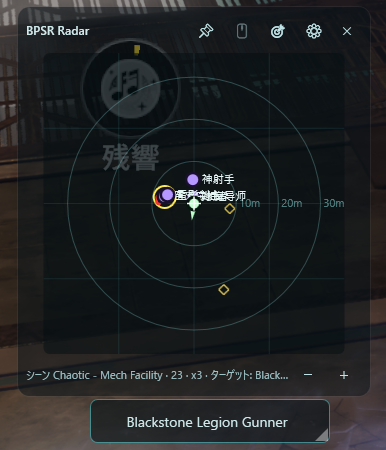

# BPSR-Radar

[English](#english) | [日本語](#日本語)

## 日本語

BLUE PROTOCOL: Star Resonance 用のスタンドアロン ミニマップ / ロックオンターゲット オーバーレイです。

### ダウンロード

[Releases](https://github.com/Warabii1248/BPSR-Radar/releases) から最新の
`BPSR-Radar-*.zip` をダウンロードし、任意のフォルダに展開して
`BPSR-Radar.exe` を実行してください。インストーラや .NET ランタイムは
不要です。展開後の中身は実行ファイル2つと `Data` フォルダだけです
（`BPSR-Radar.LockTarget.exe` はロックオン表示用で、本体から自動で起動されます）。

### 必要環境

- Windows 10/11 (x64)
- [Npcap](https://npcap.com/#download) — パケットキャプチャに必要です。
  別途インストールしてください。

### 使い方

- 透過・クリックスルーのレーダーオーバーレイと、独立したターゲット
  オーバーレイを表示します。
- `Ctrl+Alt+R` でクリックスルーの ON/OFF を切り替えます。
- ロックオンターゲット機能は管理者権限で動作するヘルパー
  (`BPSR-Radar.LockTarget.exe`) を起動するため、UAC プロンプトが表示
  されます。ゲームプロセスが高い整合性レベルで動作しているため、
  読み取り専用のメモリアクセスにも管理者権限が必要です。
  拒否した場合はこの機能のみ無効になります。
- 表示されるのは**手動ロック（赤マーカー）だけ**です。攻撃範囲の敵に自動で付く
  仮ロック（青マーカー）では表示は変わりません。釣っている最中に狙いを固定して
  おくための機能なので、勝手に切り替わらないことを優先しています。
- ロックオンのキー割り当てが既定（マウス中ボタン）と違う場合は、
  `%LOCALAPPDATA%\BPSR-Radar\settings.json` の `LockKeyVk` に
  [仮想キーコード](https://learn.microsoft.com/windows/win32/inputdev/virtual-key-codes)
  を10進で設定してください（`0` で無効）。設定しなくても表示はされますが、
  **設定しておくことを勧めます**: 場所を移った直後の初回表示が早くなるほか、
  ロックしたのに表示が出なかったときの自動復帰がこのキーを見て働きます。
  コントローラーの場合は `0` のままで問題ありません。

### 注意事項

- 非公式のサードパーティツールです。利用は自己責任でお願いします。
- アンインストールは展開したフォルダと、下記2か所を削除してください。
  - `%LOCALAPPDATA%\BPSR-Radar\` — 設定と名前キャッシュ
  - `%TEMP%\BPSR-Radar\` — 実行時の状態ファイル（再作成されます）
- レジストリには何も書き込みません。ゲームのメモリは読み取りのみで、
  書き込み・インジェクション・フックは行いません。
- ロックオンの対象を探すときだけ、タスクマネージャー上のゲームのメモリ使用量が
  数百MB増えて見えることがあります。読み取ったページが OS によってゲーム側に
  常駐扱いされるためで、ゲームが余分に確保しているわけではありません。

## English

Standalone minimap / lock-on target overlay for BLUE PROTOCOL: Star Resonance.

### Download

Get the latest `BPSR-Radar-*.zip` from
[Releases](https://github.com/Warabii1248/BPSR-Radar/releases), extract it
anywhere, and run `BPSR-Radar.exe`. No installer and no .NET runtime are
required. What you unpack is two executables and a `Data` folder;
`BPSR-Radar.LockTarget.exe` serves the lock-on display and is started by the
app itself.

### Requirements

- Windows 10/11 (x64)
- [Npcap](https://npcap.com/#download) — required for packet capture.
  Install it separately.

### Usage

- Transparent click-through radar overlay plus a separate target overlay.
- `Ctrl+Alt+R` toggles click-through.
- The lock-on target feature launches an elevated helper
  (`BPSR-Radar.LockTarget.exe`) and shows a UAC prompt — the game process
  runs at high integrity, so read-only memory access requires administrator
  rights. Declining the prompt disables only that feature.
- Only the **manual lock (red marker)** is shown. The provisional lock the game
  takes automatically on whatever comes into attack range (blue marker) does not
  change the display: the point of the feature is to hold an aim you set while
  pulling, so it must not switch on its own.
- If your lock-on key is not the default (middle mouse button), set `LockKeyVk`
  in `%LOCALAPPDATA%\BPSR-Radar\settings.json` to its
  [virtual-key code](https://learn.microsoft.com/windows/win32/inputdev/virtual-key-codes)
  in decimal, or `0` to switch it off. The target still appears without it, but
  setting it is recommended: as well as making the first lock after a zone
  change show up sooner, it is what lets the overlay notice that a lock you
  made did not appear, and go looking for it. Leave it at `0` on a controller.

### Notes

- Unofficial third-party tool. Use it at your own risk.
- To uninstall, delete the extracted folder and these two directories:
  - `%LOCALAPPDATA%\BPSR-Radar\` - settings and the name cache
  - `%TEMP%\BPSR-Radar\` - runtime state, recreated as needed
- Nothing is written to the registry. The game's memory is only ever read:
  no writes, no injection, no hooks.
- While the tool is looking for the lock-on target, Task Manager may show the
  game using a few hundred MB more. Reading a page makes Windows count it as
  resident in the game; the game has not allocated anything extra.

## License

MIT. Includes code derived from an MIT-licensed open-source project;
see LICENSE for copyright attribution.
